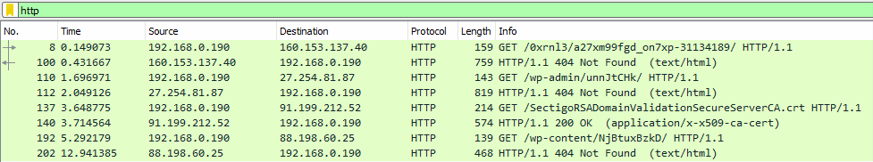

Analysis of the domains showed that web infrastructure was out-of-date. In order to confirm that I tried to download content of 126.exe file.
To do that I connected my Windows machine to the Internet and I installed and turned on Wireshark on it.

I started PowerShell with administrator's privileges and I allowed for PowerShell scripts execution:

```powershell                
Set-ExecutionPolicy RemoteSigned
```   
I opened PowerShell ISE and pasted there the dropper content and saved it to a .ps1 file.


I added comment to line 17.


And finally started the script. When script ended execution I opened Wireshark, stopped the capturing and used http filter.
I saw that 3 domains responded with 404 code.




Traffic to tananfood.com was encrypted:


And traffic for biswalfoodcircle.com looked like this:


When I tried to open that site in browser, I got similar results. Site was loading very long and provided no content.

#### Table of content:

1.  [Environment configuration](/blog/first-steps-in-re/environment-configuration)
2.  [Initial analysis](/blog/first-steps-in-re/initial-analysis)
3.  [Macro analysis](/blog/first-steps-in-re/macro-analysis)
4.  [Dropper analysis](/blog/first-steps-in-re/dropper-analysis)
5.  [Detonation](/blog/first-steps-in-re/detonation)
7.  [Domain analysis](/blog/first-steps-in-re/domain-analysis)
8.  [Detonation ver. 2](/blog/first-steps-in-re/detonation-v2)
9.  [Summary](/blog/first-steps-in-re/summary)
