WebClient from dropper module tried to download content from that sites:

```txt
http://www.pieceofpassion.net/0xrnl3/a27xm99fgd_on7xp-31134189/
http://www.marketfxelite.com/wp-admin/unnJtCHk/
https://tananfood.com/wp-includes/yoclwyWE/
http://raisabook.com/wp-content/NjBtuxBzkD/
http://biswalfoodcircle.com/vcobhlons/kaf6j_71wzkgvqso-8/
```

But during the second detonation it turned out that under presented URIs there was no content. Servers responded with 404 code.
I used URLhaus and I found out that all sites were taken down.

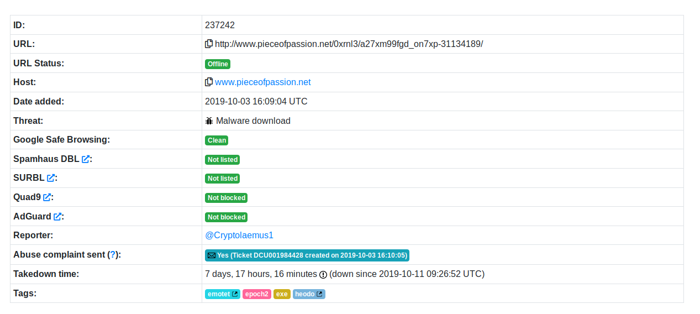
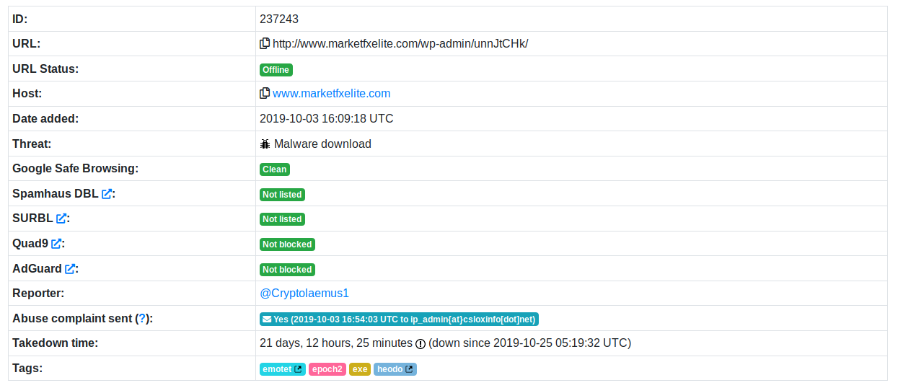
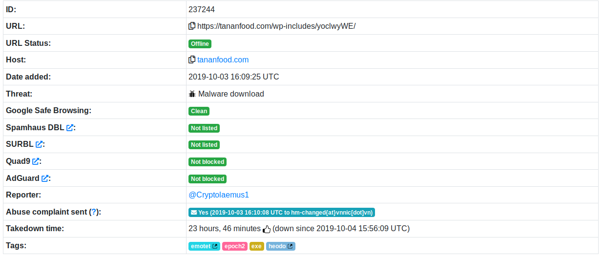
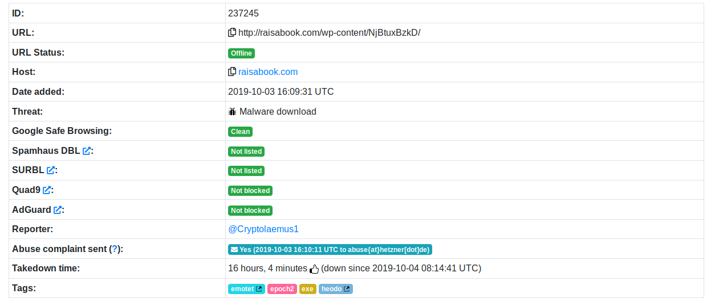
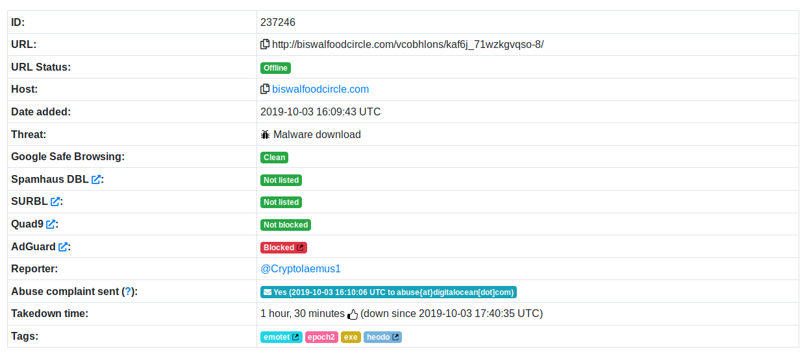

I also used Wayback Machine to check if I would be able to restore content of these sites. Interestingly enough, certain parts of each site weren't archived.

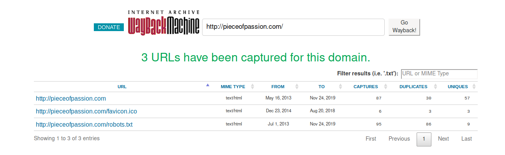
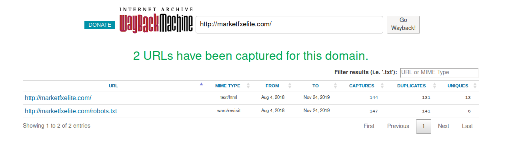
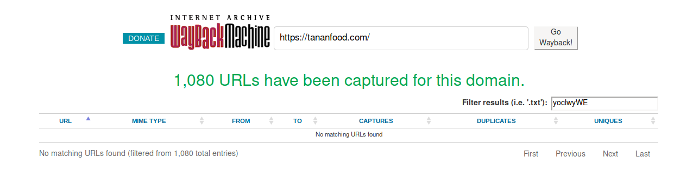
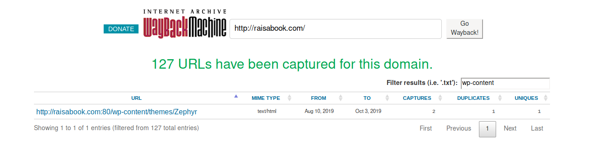
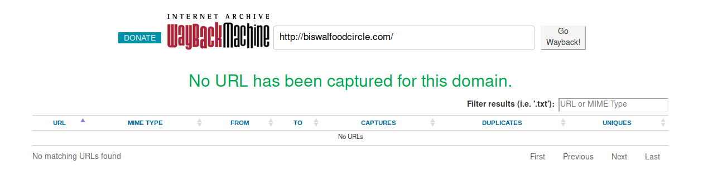

At this point it became obvious that infrastructure is "dead". I searched the web for information about these domains and URIs and most of results indicated a link to the emotet.  

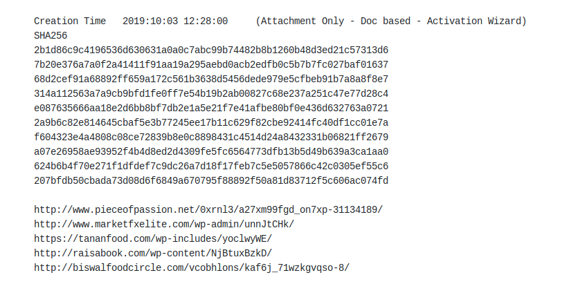

Examples: [click](https://paste.cryptolaemus.com/emotet/2019/10/03/emotet-malware-IoCs_10-03-19.html), [click](https://gist.github.com/wagonza/eb37bc2f23afee07872b0260966cbbe3) and [click](https://www.joesandbox.com/analysis/189358/0/executive).

#### Table of content:

1.  [Environment configuration](/blog/first-steps-in-re/environment-configuration)
2.  [Initial analysis](/blog/first-steps-in-re/initial-analysis)
3.  [Macro analysis](/blog/first-steps-in-re/macro-analysis)
4.  [Dropper analysis](/blog/first-steps-in-re/dropper-analysis)
5.  [Detonation](/blog/first-steps-in-re/detonation)
7.  [Domain analysis](/blog/first-steps-in-re/domain-analysis)
8.  [Detonation ver. 2](/blog/first-steps-in-re/detonation-v2)
9.  [Summary](/blog/first-steps-in-re/summary)
