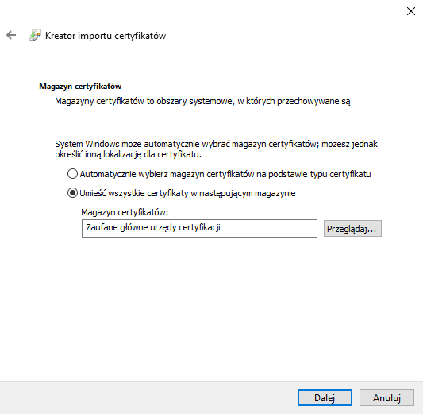

First I prepared safe environment where I was able to conduct analysis. I used Virtualbox in order to create virtual machines and install necersary software.

Virtualbox can be downloaded from this site:

[VirtualBox](https://www.virtualbox.org/)

Additionaly I installed "VirtualBox Extension Pack" which allowed me to use some feautures. 

As my main system I chose Windows 10 Home 64-bit with latest updates. You can find it here:

[Windows 10](https://www.microsoft.com/pl-pl/software-download/windows10ISO)

Having choosen the system, I created virtual machine and installed system on it. I think that the process is so intuitive that it doesn't require any explanation. 

After installation of the system I created a snapshot because if the system gets damaged, I can easily restore it.   

To do that you have to expand context menu and choose "Snapshots".


Then click "Take".


In that window you can provide a name and comment for your snapshot. 


If everything is correct, you should see your named snapshot. 


### Software installation

When virtual machine was ready and "snapshoted" I provided access to the Internet and downloaded folowing programs:

  * [IDA Free](https://www.hex-rays.com/products/ida/support/download_freeware/) or [Ghidra](https://ghidra-sre.org/)
  * [x64dbg](https://x64dbg.com/)
  * [PE View](http://wjradburn.com/software/)
  * [Sysinternals Suite](https://docs.microsoft.com/en-us/sysinternals/downloads/sysinternals-suite)
  * [HxD Hex Editor](https://mh-nexus.de/en/hxd/)
  * [olevba](https://github.com/decalage2/oletools/wiki/olevba)
  * [oledump](https://blog.didierstevens.com/programs/oledump-py/)
  * [Wireshark](https://www.wireshark.org/)

I also omitted the process of installation because it's quite easy. In most cases you have to left default values and click "Next". Ghidra has a more complex installation because you have to provide JDK 11 and modify your PATH. Don't worry though Ghidra's manual extexts how to do that.

After software installation I changed network adapter from "Briged Adapter" to "Internal Network".

### A listening machine

Because my main machine worked in isolated network I also created second machine in order to capture network traffic from the isolated one.
I decided to use Kali Linux because it has pre installed all the tools which I wanted to use. 

[Kali Linux](https://www.kali.org/downloads/)

Note here that you can download ISO or OVA file which can be imported to VirtualBox and by this process of system installation can be omitted.

If you decide to choose another Linux distrubition, you have to manually install:

  * Wireshark
  * INetSim
  * Burp Suite

Additionaly I installed tools to analyse OLE2 files (oletools and oledump).

For the good start:

```bash                    
apt update
apt upgrade
```                    

Now it's time for python packet manager:

```bash                    
apt install python-pip
```                    
                
Then oletools:

```bash                    
pip install oletools
```             
                
And oledump:

```bash                    
wget https://didierstevens.com/files/software/oledump_V0_0_44.zip                      
unzip oledump_V0_0_44 -d oledump
```                    
                
At the end I also changed network adapter from "Briged Adapter" to "Internal Network".

### Software configuration and addressing of the systems

To provide proper packet flow it requires a valid addressation. I edited /etc/network/interfaces file by adding following content:

```txt  
auto eh0 iface 
eth0 inet static 
  address 10.10.10.1 
  netmask 255.255.255.0
```

Then I started interface:

```bash
ifup eth0
```

Here it is very important to correctly identify network interfaces if you want to check how your network interfaces were marked use:

```bash
ip -c a
```


You should see two interfaces (if you set only one network adapter). One of them is loopback marked as "lo". The secod one however, is the one which you want to configure. In my case it was eth0.
Next I configured software. Firstly I chose INetSim. I created directory to store configuration and output files.

```bash                    
mkdir malware-analysis
```                    
                
Directory fo INetSim configuration:

```bash                    
mkdir inetsim-ma
```                   
                
Then I copied configuration files:

```bash                    
cp /etc/inetsim/inetsim.conf malware-analysis/inetsim-ma/
cp -r /var/lib/inetsim malware-analysis/inetsim-ma/data
cd malware-analysis/inetsim-ma/
chmod -R 777 data/
```                    
                
And edited inetsim.conf:

```bash 
#service_bind_address 10.10.10.1
service_bind_address 0.0.0.0

#dns_default_ip 10.10.10.1
dns_default_ip 10.10.10.1

#https_bind_port 443
https_bind_port 8443
``` 
              
After that I launched INetSim:

```bash                    
inetsim –data data/ --conf inetsim.conf
```                   


Next it was time for Burp Suite. I started it and clicked Proxy -> Options.


Then I edited existing listener by selecting it and clicking "Edit".

- In Binding:
  - Bind to port: 443
  - Bind to address: all interfaces
- In Request handling:
  - Redirect to host: localhost
  - Redirect to port: 8443
  - Select an option Support invisible proxying


I added one aditional listener in order to download Burp's CA on Windows machine.

- In Binding
  - Bind to port: 8080
  - Bind to adress: All interfaces


My final settings:


At the end I disabled interception. Proxy -> Intercept -> Intercept is off


On Windows I configured network interface.


I deactivated Windows Defender and firewall.


And I checked my network by using ping. 


I also checked INetSim by providing any valid url.


At the end of this process I installed Burp CA on Windows.
I started browser and went to 10.10.10.1:8080.


I clicked in "CA Certificate", saved certificate on my disc and opened it by double clicking.

Install certificate → Local computer → Next→ Certificate's storage: Trusted CA → Next → End.





After proper installation you should see that page for all https sites.


Finally it's time for main part of analysis!

#### Table of content:

1.  [Environment configuration](/blog/first-steps-in-re/environment-configuration)
2.  [Initial analysis](/blog/first-steps-in-re/initial-analysis)
3.  [Macro analysis](/blog/first-steps-in-re/macro-analysis)
4.  [Dropper analysis](/blog/first-steps-in-re/dropper-analysis)
5.  [Detonation](/blog/first-steps-in-re/detonation)
7.  [Domain analysis](/blog/first-steps-in-re/domain-analysis)
8.  [Detonation ver. 2](/blog/first-steps-in-re/detonation-v2)
9.  [Summary](/blog/first-steps-in-re/summary)
