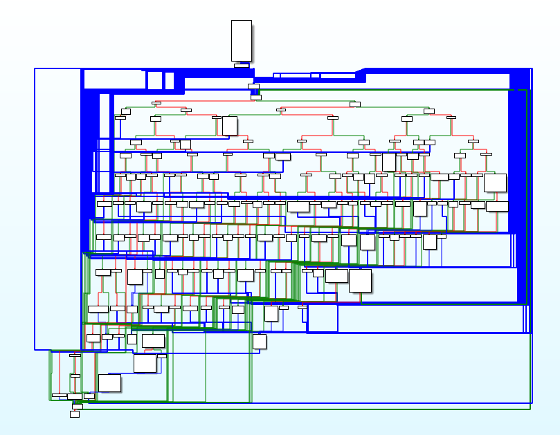

I managed to reach the end of this project. Malware delivery chain was broken by domains' takedown and I wasn't able to analyse the exe content (And I think it's good because probably it would defeat me, so I definitely need more practise on simpler examples).

For example this looks quite scary ([Source](https://www.cert.pl/en/news/single/whats-up-emotet/)):

I successfully deobfuscated macro's and dropper's code and the process of doing this was quite nice.

I learned about call operators in PowerShell ('.' and '&') and little bit about Win32_Process API. 
I had a chance to play with some new tools like oledump and gained some knowledge about creating PowerShell process by macro.

To sum up whole, the project was an interesting experience but quite too ambitious for my current skills. I think that more could be done in case of the domain analysis but deadline has come.

#### Table of content:

1.  [Environment configuration](/blog/first-steps-in-re/environment-configuration)
2.  [Initial analysis](/blog/first-steps-in-re/initial-analysis)
3.  [Macro analysis](/blog/first-steps-in-re/macro-analysis)
4.  [Dropper analysis](/blog/first-steps-in-re/dropper-analysis)
5.  [Detonation](/blog/first-steps-in-re/detonation)
7.  [Domain analysis](/blog/first-steps-in-re/domain-analysis)
8.  [Detonation ver. 2](/blog/first-steps-in-re/detonation-v2)
9.  [Summary](/blog/first-steps-in-re/summary)
